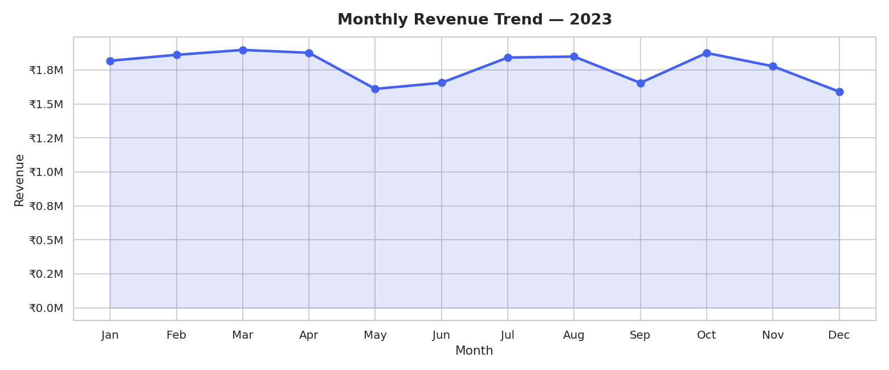
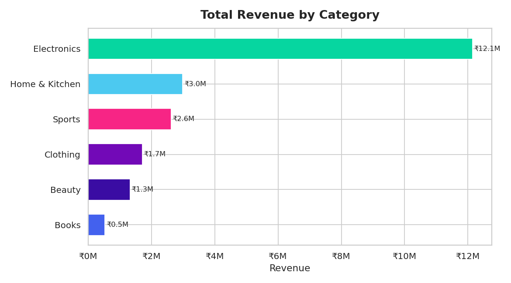
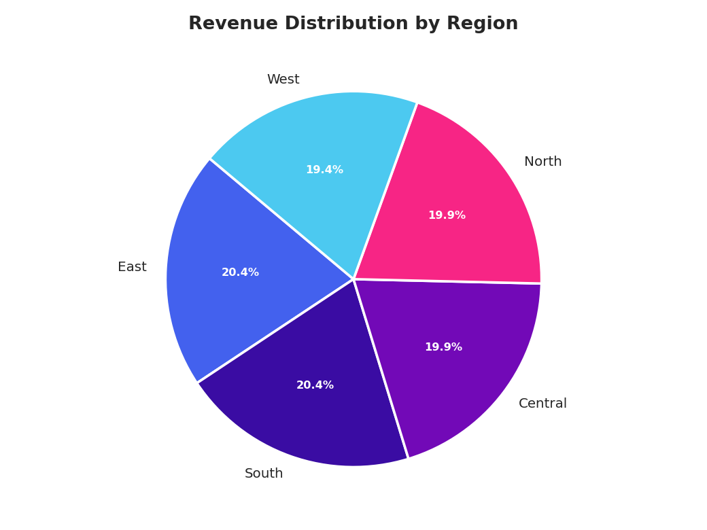
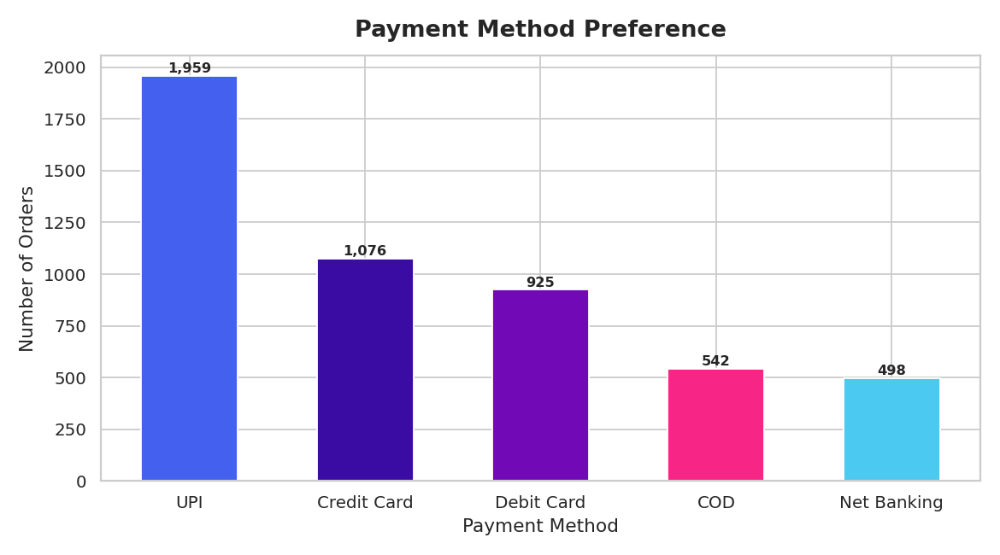
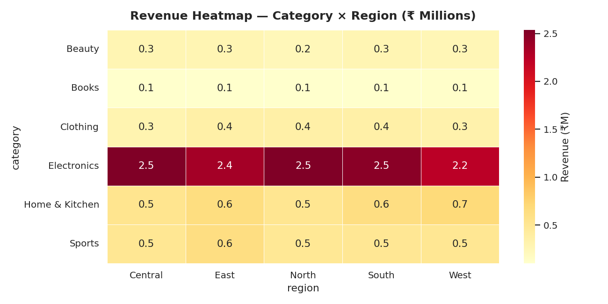
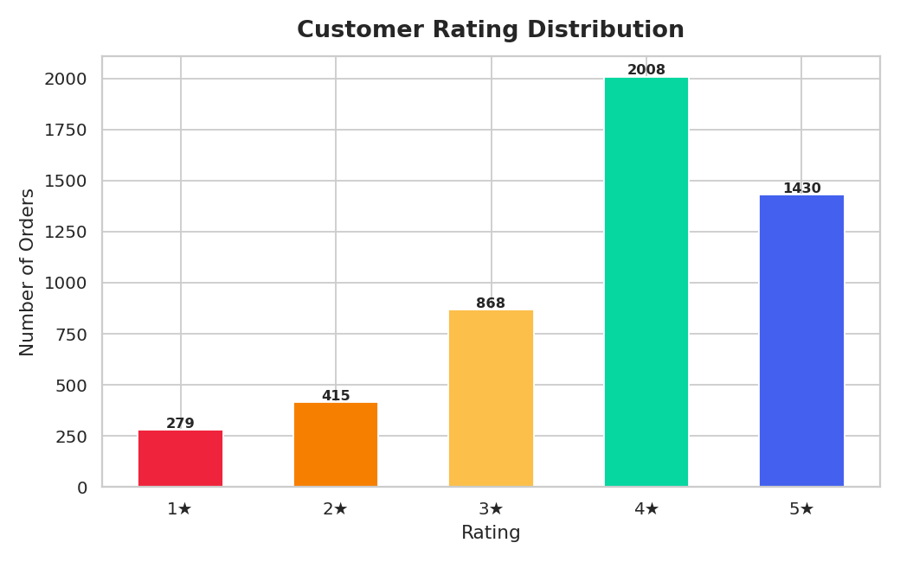
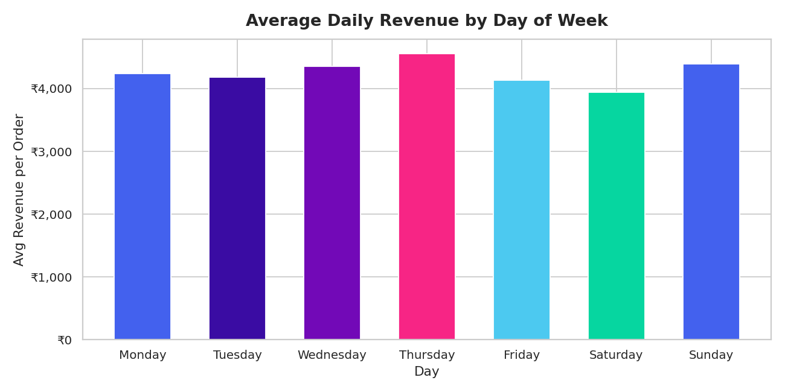

# 📊 E-Commerce Sales Analytics

A complete end-to-end data analytics project analyzing **5,000 e-commerce orders** across categories, regions, and time periods — built with Python, Pandas, Matplotlib & Seaborn.

---

## 🚀 Project Overview

This project simulates and analyzes sales data for an Indian e-commerce platform (2023), uncovering actionable business insights through:

- Revenue trend analysis
- Category & regional performance
- Customer behaviour patterns
- Payment preference breakdown
- Return rate & rating analysis

---

## 📁 Project Structure

```
ecommerce-sales-analytics/
│
├── data/
│   └── ecommerce_sales.csv       # Generated synthetic dataset (5,000 orders)
│
├── src/
│   ├── generate_data.py          # Script to generate the synthetic dataset
│   └── analysis.py               # Full analysis + chart generation
│
├── outputs/
│   ├── 01_monthly_revenue.png
│   ├── 02_category_revenue.png
│   ├── 03_region_revenue.png
│   ├── 04_payment_methods.png
│   ├── 05_heatmap_cat_region.png
│   ├── 06_rating_distribution.png
│   ├── 07_weekly_pattern.png
│   └── kpi_summary.csv
│
├── requirements.txt
└── README.md
```

---

## 📈 Key Insights

| KPI | Value |
|-----|-------|
| Total Orders | 5,000 |
| Total Revenue | ₹2.13 Crore |
| Avg Order Value | ₹4,261 |
| Return Rate | 8.3% |
| Avg Rating | 3.78 / 5 |
| Top Category | Electronics |
| Top Region | East |
| Top Payment | UPI (40%) |

---

## 📊 Visualizations

### 1. Monthly Revenue Trend


### 2. Revenue by Category


### 3. Region-wise Revenue Distribution


### 4. Payment Method Preference


### 5. Revenue Heatmap (Category × Region)


### 6. Customer Rating Distribution


### 7. Weekly Sales Pattern


---

## ⚙️ Setup & Run

```bash
# 1. Clone the repository
git clone https://github.com/YOUR_USERNAME/ecommerce-sales-analytics.git
cd ecommerce-sales-analytics

# 2. Install dependencies
pip install -r requirements.txt

# 3. Generate the dataset
python src/generate_data.py

# 4. Run the full analysis
python src/analysis.py
```

All charts will be saved to the `outputs/` folder.

---

## 🛠️ Tech Stack

- **Python 3.10+**
- **Pandas** — data manipulation
- **NumPy** — numerical operations
- **Matplotlib** — custom visualizations
- **Seaborn** — statistical plots

---

## 👤 Author

**Gargeya** — B.Tech CSE, GITAM University  
[GitHub](https://github.com/YOUR_USERNAME) • [LinkedIn](https://linkedin.com/in/YOUR_PROFILE)

---

## 📄 License

MIT License — free to use and modify.
